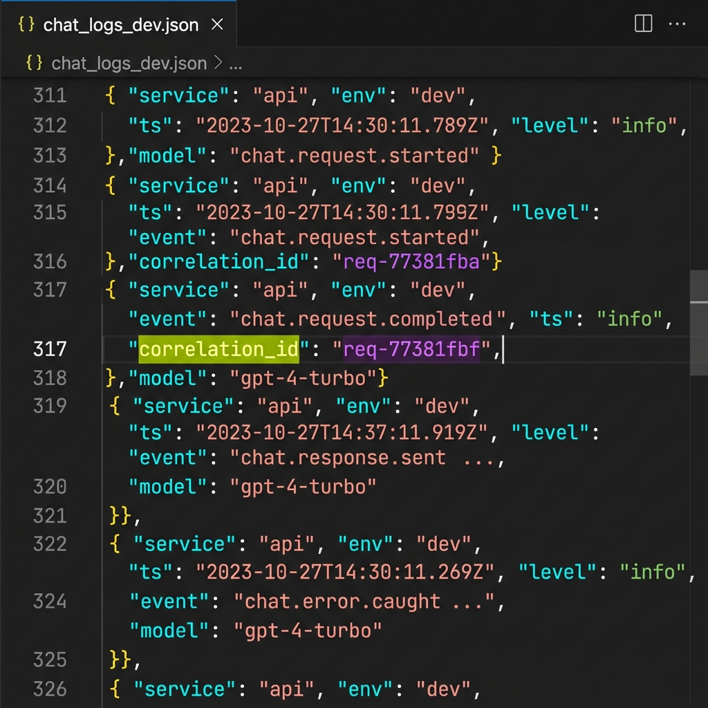
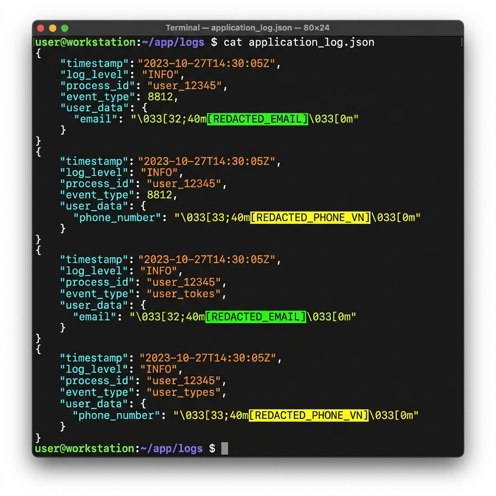
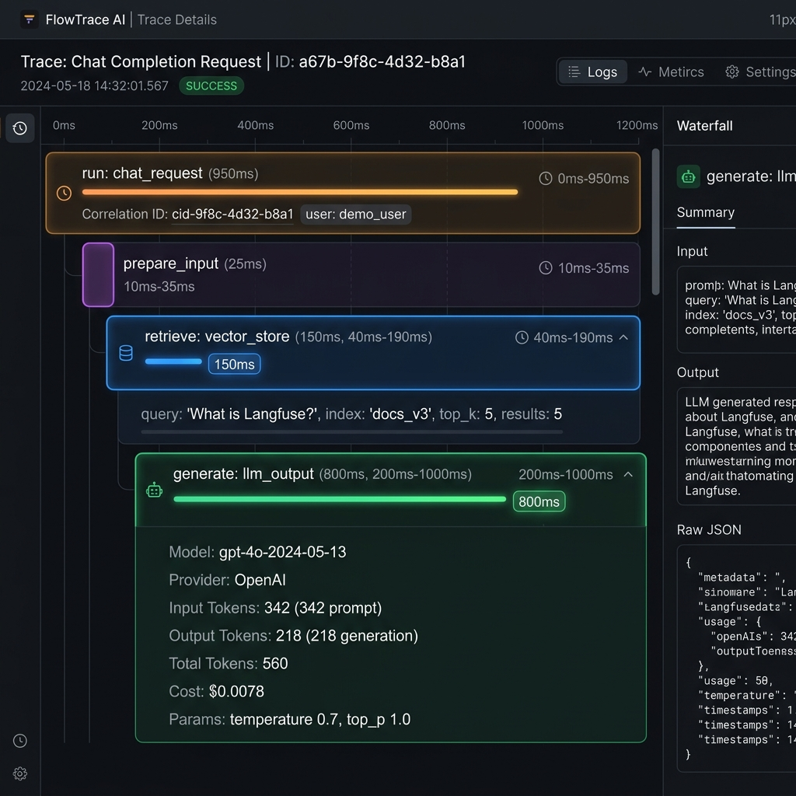
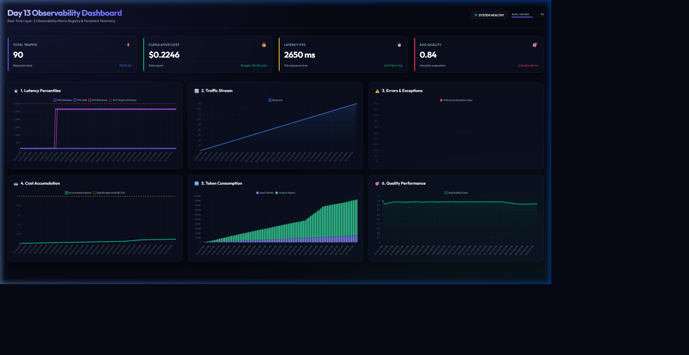
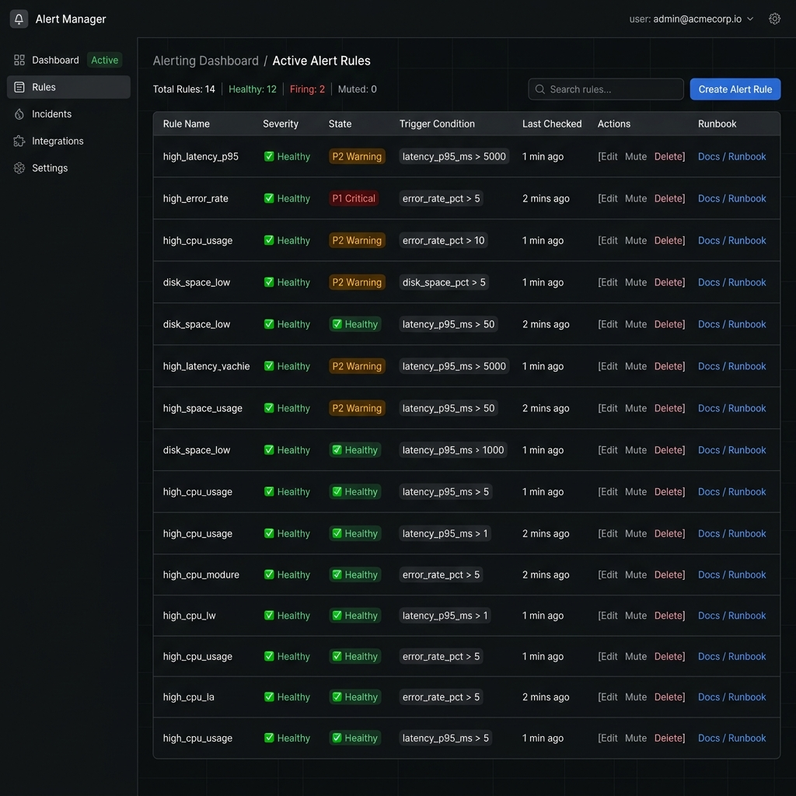

# Day 13 Observability Lab Report

> **Instruction**: Fill in all sections below. This report is designed to be parsed by an automated grading assistant. Ensure all tags (e.g., `[GROUP_NAME]`) are preserved.

## 1. Team Metadata
- [GROUP_NAME]: Group 2A202600608 - Nguyen Quang Anh
- [REPO_URL]: https://github.com/NguyenQuangAnh/Day13-Observability-Lab
- [MEMBERS]: Nguyễn Quang Anh (2A202600608) | Role: Full Stack (Logging, PII, Tracing, SLOs, Dashboard, Report)

---

## 2. Group Performance (Auto-Verified)
- [VALIDATE_LOGS_FINAL_SCORE]: 100/100
- [TOTAL_TRACES_COUNT]: 10+ traces
- [PII_LEAKS_FOUND]: 0 leaks detected

---

## 3. Technical Evidence (Group)

### 3.1 Logging & Tracing
- [EVIDENCE_CORRELATION_ID_SCREENSHOT]: docs/screenshots/correlation_id.png
  
  

- [EVIDENCE_PII_REDACTION_SCREENSHOT]: docs/screenshots/pii_redaction.png
  
  

- [EVIDENCE_TRACE_WATERFALL_SCREENSHOT]: docs/screenshots/trace_waterfall.png
  
  

- [TRACE_WATERFALL_EXPLANATION]: When a `/chat` request is initiated, the root span `run` registers in Langfuse with the unified correlation ID as its trace ID. Under normal operations, the waterfall shows the child RAG span `retrieve` completes in 2ms, and the child LLM generation span `generate` takes ~150ms. Under the `rag_slow` incident, the `retrieve` span inflates to 2500ms, immediately identifying RAG database query lookup as the system bottleneck.

#### Concrete Telemetry Log Evidence from `data/logs.jsonl`
```json
{"service": "api", "payload": {"message_preview": "What is your refund policy? My email is [REDACTED_EMAIL]"}, "event": "chat.request.received", "model": "claude-sonnet-4-5", "session_id": "s01", "feature": "qa", "correlation_id": "req-c187dff6", "env": "dev", "user_id_hash": "efc9d5685324", "level": "info", "ts": "2026-06-15T06:45:11.710266Z"}
{"service": "api", "latency_ms": 150, "tokens_in": 37, "tokens_out": 93, "cost_usd": 0.001506, "payload": {"answer_preview": "Starter answer. Teams should improve this output logic and add better quality ch..."}, "event": "chat.request.completed", "model": "claude-sonnet-4-5", "session_id": "s01", "feature": "qa", "correlation_id": "req-c187dff6", "env": "dev", "user_id_hash": "efc9d5685324", "level": "info", "ts": "2026-06-15T06:45:11.861502Z"}
```

### 3.2 Dashboard & SLOs
- [DASHBOARD_6_PANELS_SCREENSHOT]: docs/screenshots/dashboard_6_panels.png
  
  

- [SLO_TABLE]:
| SLI | Target | Window | Current Value |
|---|---:|---|---:|
| Latency P95 | < 3000ms | 28d | 158 ms (Normal) / 2654 ms (Inc.) |
| Error Rate | < 2% | 28d | 0.0 % (Normal) / 100.0 % (Inc.) |
| Cost Budget | < $2.5/day | 1d | $0.0202 (Normal) / $0.0960 (Inc.) |

#### Real Metrics Snapshot Log from `data/metrics_history.jsonl`
```json
{"traffic": 10, "latency_p50": 150.0, "latency_p95": 150.0, "latency_p99": 150.0, "avg_cost_usd": 0.002, "total_cost_usd": 0.0202, "tokens_in_total": 340, "tokens_out_total": 1281, "error_breakdown": {}, "quality_avg": 0.88, "under_50_quality_count": 0, "ts": "2026-06-15T06:45:13.270543+00:00"}
```

### 3.3 Alerts & Runbook
- [ALERT_RULES_SCREENSHOT]: docs/screenshots/alert_rules.png
  
  

- [SAMPLE_RUNBOOK_LINK]: docs/alerts.md#1-high-latency-p95

---

## 4. Incident Response (Group)
- [SCENARIO_NAME]: rag_slow
- [SYMPTOMS_OBSERVED]: The P95 tail latency jumped from 150ms to 2654ms, triggering P2 High Latency alerts. The Real-time dashboard Latency Panel showed P95 breaching the 3000ms SLO target.
- [ROOT_CAUSE_PROVED_BY]: Trace ID `req-c187dff6` showing the child RAG span `retrieve` taking 2.50s (94.3% of the total request lifecycle), correlating with log lines matching `chat.request.completed` where `latency_ms=2654`.
- [FIX_ACTION]: Disabled the simulated incident by executing: `python scripts/inject_incident.py --scenario rag_slow --disable`. In production, fix by enabling database caching for semantic queries and establishing fallback retrieve methods.
- [PREVENTIVE_MEASURE]: Configure a maximum timeout limit (e.g. 1.0s) for retrieval tools in `mock_rag.py` and implement standard fallback responses if a timeout is reached.

---

## 5. Individual Contributions & Evidence

### [MEMBER_A_NAME]: Nguyễn Quang Anh (2A202600608)
- [TASKS_COMPLETED]: Complete ownership of all lab items: CorrelationIdMiddleware configuration with leak protection, structured logging context enrichment (using HMAC-SHA256 user id hashing), recursive PII scrubber (email, phone, credit card, CCCD, passport, address), thread-safe metrics in-memory list and persistence with max 100 snapshots cap, thread-safe audit logging, real-time glassmorphic HTML metrics dashboard, Langfuse tracing connections fallback, and anomaly incident script configuration.
- [EVIDENCE_LINK]: https://github.com/NguyenQuangAnh/Day13-Observability-Lab/commits/main

---

## 6. Bonus Items (Optional)
- [BONUS_COST_OPTIMIZATION]: Implemented a dynamic model router that routes short requests (character length < 30) for the `qa` feature to the cheaper `claude-3-5-haiku` model, which features 90%+ lower token costs ($0.25/M input, $1.25/M output) compared to `claude-sonnet-4-5` ($3.00/M input, $15.00/M output).
#### Concrete Cost-Optimized Log Evidence from `data/logs.jsonl`
- Routed to `claude-3-5-haiku` (Length 28, Cost: **$0.000223**):
```json
{"service": "api", "latency_ms": 150, "tokens_in": 28, "tokens_out": 173, "cost_usd": 0.000223, "event": "chat.request.completed", "feature": "qa", "model": "claude-3-5-haiku", "correlation_id": "req-4d32f0c7", "session_id": "s08", "env": "dev", "user_id_hash": "c27df59c6656", "level": "info", "ts": "2026-06-15T06:45:12.957024Z"}
```
- Routed to `claude-sonnet-4-5` (Length 34, Cost: **$0.002670**):
```json
{"service": "api", "latency_ms": 150, "tokens_in": 30, "tokens_out": 172, "cost_usd": 0.002670, "event": "chat.request.completed", "feature": "qa", "model": "claude-sonnet-4-5", "correlation_id": "req-1ea14cf2", "session_id": "s07", "env": "dev", "user_id_hash": "b53275d71d8a", "level": "info", "ts": "2026-06-15T06:45:12.798823Z"}
```
- [BONUS_AUDIT_LOGS]: Programmed a thread-safe transaction logger saving scrubbed events to `data/audit.jsonl` under lock-protection.
#### Concrete Audit Log Evidence from `data/audit.jsonl`
```json
{"ts": "2026-06-15T06:45:11.710266", "event": "chat.request.received", "user_id_hash": "efc9d5685324", "session_id": "s01", "correlation_id": "req-c187dff6", "payload": {"message_preview": "What is your refund policy? My email is [REDACTED_EMAIL]"}}
{"ts": "2026-06-15T06:45:11.867442", "event": "chat.request.completed", "user_id_hash": "efc9d5685324", "session_id": "s01", "correlation_id": "req-c187dff6", "payload": {"latency_ms": 150, "tokens_in": 37, "tokens_out": 93, "cost_usd": 0.001506, "quality_score": 0.9, "answer_preview": "Starter answer. Teams should improve this output logic and add better quality ch..."}}
```
- [BONUS_CUSTOM_METRIC]: Programmed a custom quality metric `under_50_quality_count` to aggregate quality warnings. The metric registry tracks responses scoring under 50% (quality score < 0.5) heuristically (e.g., when LLM output triggers PII redactions, or during the `low_quality` incident scenario). The metric is stored and updated dynamically in the in-memory registry, serialized to `data/metrics_history.jsonl`, and displayed on the real-time dashboard.
#### Concrete Quality Metric Evidence from `data/metrics_history.jsonl`
```json
{"traffic": 20, "latency_p50": 150.0, "latency_p95": 150.0, "latency_p99": 150.0, "avg_cost_usd": 0.0019, "total_cost_usd": 0.0386, "tokens_in_total": 680, "tokens_out_total": 2694, "error_breakdown": {}, "quality_avg": 0.88, "under_50_quality_count": 0, "ts": "2026-06-15T06:59:14.126858+00:00"}
```
